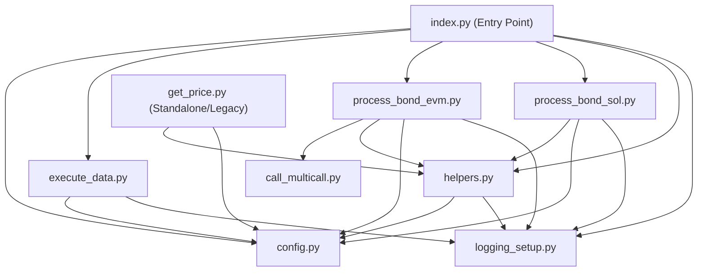
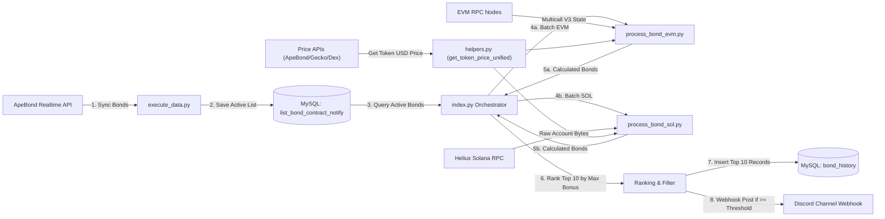
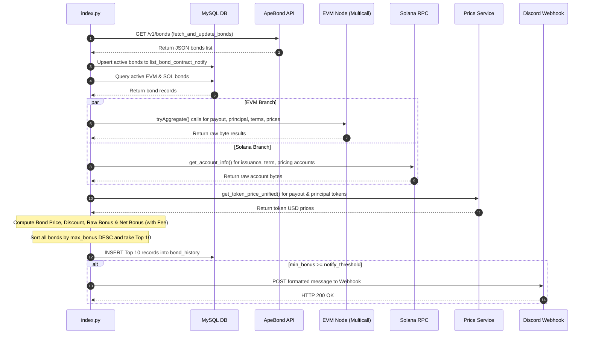

# ApeBond Notify — Technical Analysis & Comprehensive Source Code Report

> **Dự án:** `apebond-notify`  
> **Mục tiêu:** Phân tích kỹ thuật chi tiết 100% dựa trên source code thực tế, phục vụ công tác tái cấu trúc (refactoring) và module hóa.  
> **Phạm vi kiểm tra:** Toàn bộ file Python (`index.py`, `config.py`, `helpers.py`, `execute_data.py`, `process_bond_evm.py`, `process_bond_sol.py`, `get_price.py`, `call_multicall.py`, `logging_setup.py`), file `.env`, cache ABI và cơ sở dữ liệu.

---

# 1. Project Overview

## 1.1 Mục tiêu hệ thống
`apebond-notify` là hệ thống tự động quét, truy vấn dữ liệu on-chain, định giá token, tính toán chỉ số tài chính (Bond Price, Bonus, Max Buy), xếp hạng lợi nhuận và gửi thông báo qua Discord cho các cơ hội đầu tư Bond từ giao thức **ApeBond** trên cả 2 hệ sinh thái:
* **EVM Blockchains:** Ethereum (ETH), BNB Chain (BNB), Polygon (POL), Arbitrum (ARB), Base (BAS), Linea (LIN), Sonic (SON), Berachain (BER), Unichain (UNI), Hyperliquid (HYPER).
* **Solana Network (SOL):** Truy vấn trực tiếp qua Solana RPC.

## 1.2 Kiến trúc xử lý luồng
Hệ thống vận hành theo cơ chế **Batch Processing**:
1. Đồng bộ danh sách Bond từ API ApeBond vào MySQL DB.
2. Lấy các Bond active từ DB.
3. Song song xử lý luồng EVM (dùng Multicall V3) và Solana (decode raw account bytes).
4. Truy vấn giá token từ các API (ApeBond Price API -> CoinGecko -> DexScreener).
5. Tính toán các metric (Bonus, Max Buy, Min/Max Price).
6. Sắp xếp Top 10 theo `max_bonus` giảm dần.
7. Lưu lịch sử vào bảng `bond_history`.
8. Gửi thông báo tới Discord Webhook đối với các Bond đạt ngưỡng `MIN_BONUS_NOTIFY`.

---

# 2. Setup & Run

## 2.1 Môi trường & Phụ thuộc
* **Python Version:** Python 3.8+
* **Dependencies:** `web3`, `solana==0.36.0`, `solders`, `mysql-connector-python`, `requests`, `python-dotenv`, `discord.py`.

## 2.2 Khởi tạo và Chạy dự án
```bash
# 1. Khởi tạo virtual environment
python -m venv .venv

# Activate môi trường
# Windows:
.venv\Scripts\activate
# Linux/macOS:
source .venv/bin/activate

# 2. Cài đặt các thư viện phụ thuộc
pip install -r requirements.txt

# 3. Tạo file cấu hình môi trường .env (tham khảo Section 19)
# 4. Chạy entry point chính
python index.py
```

---

# 3. Entry Point & Component Mapping

Dưới đây là bảng xác định chính xác các component chính trong source code thực tế:

| Component | File | Function / Scope | Description |
| :--- | :--- | :--- | :--- |
| **Entry Point** | `index.py` | `if __name__ == "__main__":` (L103-L123) | Điểm khởi chạy ứng dụng, điều phối vòng lặp và xử lý ngoại lệ cấp cao nhất. |
| **Scheduler / Bedtime** | `helpers.py` | `set_bedtime()` (L46-L51), `sleep_until_wakeup()` (L54-L69) | Kiểm tra giờ ngủ (23:30 - 06:30 VN_TZ), tạm dừng hệ thống đến sáng. |
| **Bond Discovery** | `execute_data.py` | `fetch_and_update_bonds()` (L224-L331) | Khởi tạo HTTP GET `https://realtime-api.ape.bond/bonds`, upsert vào MySQL table `list_bond_contract_notify`. |
| **EVM Processing** | `process_bond_evm.py` | `process_bonds()` (L499-L515), `process_single_bond_evm()` (L357-L498) | Quản lý ThreadPoolExecutor (10 workers), gọi Multicall V3 để đọc EVM contract. |
| **Solana Processing** | `process_bond_sol.py` | `process_bond_sol()` (L354-L371), `process_single_bond_sol()` (L238-L353) | Quản lý ThreadPoolExecutor (10 workers), đọc RPC `get_account_info` và decode binary layout. |
| **Pricing** | `helpers.py` | `get_token_price_unified()` (L326-L364) | Lấy giá token theo thứ tự: ApeBond API -> CoinGecko -> DexScreener. |
| **Ranking** | `index.py` | `save_and_notify_top_bonds_by_bonus()` (L22-L100) | Sắp xếp mảng kết quả theo `max_bonus` giảm dần, cắt Top 10. |
| **Database** | `execute_data.py` | `create_database_and_table()`, `fetch_bond_data()`, `get_connection()` | Khởi tạo kết nối MySQL, tạo schema database/tables, đọc/ghi dữ liệu Bond. |
| **Discord** | `helpers.py` | `send_discord_webhook_message()` (L27-L36) | Gửi thông báo danh sách Top Bond qua HTTP POST đến Discord Webhook. |

---

# 4. Runtime Flow

Sơ đồ tuần tự runtime thực tế trong code:

```text
index.py (__main__)
    │
    ├─► helpers.set_bedtime() ──(True)──► helpers.sleep_until_wakeup() (Dừng đến 06:30)
    │        │
    │     (False)
    │        │
    ├─► execute_data.fetch_and_update_bonds() ──► HTTP GET ApeBond Realtime API ──► Upsert DB (list_bond_contract_notify)
    │
    ├─► execute_data.fetch_bond_data("EVM")  ──► Query DB lấy active EVM bonds
    ├─► execute_data.fetch_bond_data("SOL")  ──► Query DB lấy active SOL bonds
    │
    ├─► process_bond_evm.process_bonds() ──► ThreadPoolExecutor (10 workers)
    │        └─► process_single_bond_evm() ──► Multicall V3 ──► Pricing ──► EVM Bond Object
    │
    ├─► process_bond_sol.process_bond_sol() ──► ThreadPoolExecutor (10 workers)
    │        └─► process_single_bond_sol() ──► Solana RPC ──► Struct Decode ──► Pricing ──► SOL Bond Object
    │
    └─► index.save_and_notify_top_bonds_by_bonus()
             ├─► Gộp mảng (EVM + SOL)
             ├─► Sort by max_bonus DESC ──► Take Top 10
             ├─► Filter min_bonus >= notify_threshold (chọn lọc nội dung Discord)
             ├─► Insert Top 10 vào DB table (bond_history)
             └─► helpers.send_discord_webhook_message() ──► POST Discord Webhook
```

---

# 5. Phân tích Nguồn Dữ Liệu Bond (Bond Discovery)

Danh sách Bond ban đầu được lấy từ REST API của ApeBond và lưu tạm vào cơ sở dữ liệu MySQL trước khi đưa vào luồng tính toán on-chain.

## 5.1 Rest API ApeBond Discovery
* **Source:** REST API chính thức từ ApeBond
* **Endpoint:** `https://realtime-api.ape.bond/bonds` (Được khai báo tại `execute_data.py` L199)
* **HTTP Method:** `GET`
* **Timeout:** `10` giây
* **Parsing Logic:**
  - Lấy danh sách từ key `bonds`: `response.json().get('bonds', [])`.
  - Kiểm tra trạng thái: `is_active = not bond.get('soldOut', True)`. Nếu không `active`, bỏ qua (`continue`).
  - Ánh xạ `chainId`: Tra cứu `ID_CHAIN_MAP` trong `config.py` (L127-L139).
  - Trường đặc biệt Solana: `chainId == 10143` được map thành `"SOL"`.
  - **Lưu ý quan trọng trong code (`execute_data.py` L245):** Code chứa dòng lệnh `if chain_id == 10143: continue`, khiến dữ liệu Solana trả về từ API ApeBond bị **bỏ qua không lưu vào DB** trong hàm đồng bộ này! Solana bonds chỉ chạy được khi đã có sẵn trong bảng `list_bond_contract_notify`.
  - Thông tin lưu trữ: `billAddress` (đã convert `.lower()`), `payoutTokenName` (token_symbol), `status` ('active').
  - **Upsert DB Query:**
    ```sql
    INSERT INTO list_bond_contract_notify (chain, contract_address, token_symbol, status)
    VALUES (%s, %s, %s, %s)
    ON DUPLICATE KEY UPDATE
        chain = VALUES(chain),
        token_symbol = VALUES(token_symbol),
        status = VALUES(status),
        updated_at = CURRENT_TIMESTAMP
    ```
  - **Mark Missing Bonds:** Tìm các contract trong DB có trạng thái `active` nhưng không còn xuất hiện trong API response của các chain đã quét, thực hiện `UPDATE status = 'sold'`.

---

# 6. Phân tích Chi Tiết Luồng EVM

Luồng EVM được thực thi tại `process_bond_evm.py` và `call_multicall.py`.

## 6.1 RPC & Chain Mapping
RPC URL được cấu hình tại `config.py` L54-L65:
* **ETH:** `https://mainnet.infura.io/v3/<API_KEY_INFURA>` (Chain ID: 1)
* **BNB:** `https://bsc-mainnet.infura.io/v3/<API_KEY_INFURA>` (Chain ID: 56)
* **POL:** `https://polygon-mainnet.infura.io/v3/<API_KEY_INFURA>` (Chain ID: 137)
* **ARB:** `https://arbitrum-mainnet.infura.io/v3/<API_KEY_INFURA>` (Chain ID: 42161)
* **BAS:** `https://base-mainnet.infura.io/v3/<API_KEY_INFURA>` (Chain ID: 8453)
* **LIN:** `https://linea-mainnet.infura.io/v3/<API_KEY_INFURA>` (Chain ID: 59144)
* **SON:** `https://rpc.soniclabs.com` (Chain ID: 146)
* **BER:** `https://rpc.berachain.com` (Chain ID: 80094)
* **UNI:** `https://mainnet.unichain.org` (Chain ID: 130)
* **HYPER:** `https://rpc.hyperliquid.xyz/evm` (Chain ID: 999)

## 6.2 Multicall V3 Contract Reading
Địa chỉ Multicall V3 chuẩn được dùng trên tất cả các mạng EVM: `0xcA11bde05977b3631167028862bE2a173976CA11`.  
Phương thức gọi: `tryAggregate(requireSuccess=False, calls=[...])`.

Bảng tổng hợp các function contract EVM được truy vấn qua Multicall V3:

| Index | Target Method | Method Selector | Input | Output Raw Format | Used for | Decoded Field |
| :--- | :--- | :--- | :--- | :--- | :--- | :--- |
| `0` | `payoutToken()` | `0x868b5774` | None | `bytes32` | Địa chỉ token Payout | `payout_token` |
| `1` | `principalToken()` | `0xb655b38d` | None | `bytes32` | Địa chỉ token Principal (hoặc LP token) | `principal_token` |
| `2` | `trueBillPrice()` | `0xd1eb01e0` | None | `uint256` | Giá bill cơ sở (scale 1e18) | `true_bill_price` |
| `3` | `terms()` | `0x1f028fae` | None | `tuple(uint256[7])` | Các thông số hạn mức và thời gian | `terms` (dict 7 trường) |
| `4` | `feeInPayout()` | `0x582ea8fd` | None | `uint256` | Tỷ lệ phí payout | `fee_in_payout` |
| `5` | `trueBondPrices()` | `0x937c4d51` | None | `bytes` (dynamic array) | Giá bond theo từng tier | `true_bond_price_tier` |

### Giải mã dữ liệu `terms()` (`call_multicall.py` L22-L28):
Dữ liệu 224 bytes (7 x 32 bytes) được unpack thành dictionary:
1. `controlVariable`: Hệ số điều chỉnh giá.
2. `vestingTerm`: Thời hạn vesting.
3. `minimumPrice`: Giá sàn tối thiểu (`min_price` = minimumPrice / 10^principal_decimals).
4. `maxPayout`: Lượng mua tối đa cho 1 giao dịch (`max_buy` = maxPayout / 10^payout_decimals).
5. `maxDebt`: Nợ tối đa của hợp đồng.
6. `maxTotalPayout`: Tổng lượng payout tối đa (`max_price` = maxTotalPayout / 10^payout_decimals).
7. `initialDebt`: Nợ ban đầu.

## 6.3 Phân Tích Định Giá LP Token (`get_data_principal_token`)
Nếu `principalToken` là cặp Liquidity Provider (LP):
1. Thử gọi `getReserves()` trên contract LP -> Lấy `reserve0`, `reserve1`, `token0`, `token1`, `totalSupply`, `decimals`.
2. Nếu `getReserves()` thất bại, thử fallback gọi `getTotalAmounts()` -> Lấy `total0`, `total1`.
3. Lấy giá USD của `token0` và `token1` bằng `get_token_price_unified()`.
4. Tính giá LP Token:
   $$\text{value\_usd} = \left(\frac{\text{reserve0}}{10^{\text{dec0}}} \times P_{\text{token0}}\right) + \left(\frac{\text{reserve1}}{10^{\text{dec1}}} \times P_{\text{token1}}\right)$$
   $$P_{\text{principal}} = \frac{\text{value\_usd}}{\text{totalSupply} / 10^{\text{decimals}}}$$
5. Nếu không phải LP Token, coi như ERC20 thường và gọi `get_token_price_unified(chain, principal_token)`.

## 6.4 ABI Cache Mechanism
* **Cache Directory:** `abi_cache/`
* **File Naming Format:** `<chain_lower>_<bond_address_lower>.json`
* **Cache Fetch Flow:** Check file tồn tại -> Nếu có: `json.load()` -> Nếu chưa: Gọi API Explorer (Etherscan, BscScan, PolygonScan,...) -> Ghi vào file `.tmp` tạm thời -> Atomic swap `os.replace()` sang file `.json`.

---

# 7. Phân tích Chi Tiết Luồng Solana

Luồng Solana được xử lý tại `process_bond_sol.py`.

## 7.1 RPC & Program IDs
* **Solana RPC:** Read từ `HELIUS_RPC_URL` (`config.py`).
* **ApeBond Solana Program ID:** `57GQDhcco4bv4Ngcg7gc6huEYepnGU4PZAGHQCFJmjNW`
* **Metaplex Metadata Program ID:** `metaqbxxUerdq28cj1RbAWkYQm3ybzjb6a8bt518x1s`

## 7.2 Program Derived Addresses (PDA)
1. `bond_term_pubkey`: `find_program_address([b"bond_term", bytes(bond_issuance_pubkey)], PROGRAM_ID)`
2. `bond_pricing_pubkey`: `find_program_address([b"bond_pricing", bytes(bond_issuance_pubkey)], PROGRAM_ID)`
3. `bond_pubkey`: `find_program_address([b"bond", bytes(bond_issuance_pubkey), bond_index.to_bytes(4, "little")], PROGRAM_ID)`
4. `metadata_account`: `find_program_address([b"metadata", bytes(METAPLEX_PROGRAM_ID), bytes(Pubkey.from_string(mint))], METAPLEX_PROGRAM_ID)`

## 7.3 Unpack Binary Layout (`struct.unpack_from`)
Toàn bộ dữ liệu account binary được cắt 8 bytes Anchor discriminator ban đầu, sau đó giải mã:

### 1. `parse_bond_issuance` (Kích thước >= 260 bytes):
* `issuanceCounter` (u32, 4B), `bondCounter` (u32, 4B)
* `payoutMint` (Pubkey, 32B), `principalMint` (Pubkey, 32B)
* `principalMintDecimals` (u8, 1B), `payoutMintDecimals` (u8, 1B)
* `treasuryAta` (Pubkey, 32B), `status` (u8 tag: 0=paused, 1=active, 2=closed)
* `feeInPrincipal` (u64, 8B), `feePrincipalRecipient` (Pubkey, 32B)
* `feeInPayout` (u64, 8B), `feePayoutRecipient` (Pubkey, 32B)
* `partnerPrincipalRecipient` (32B), `collection` (32B), `bump` (u8, 1B).

### 2. `parse_bond_pricing` (Kích thước >= 48 bytes):
Unpack `<6Q` (6 u64 fields, mỗi field 8 bytes): `total_debt`, `total_payout_given`, `total_principal_billed`, `last_decay`, `last_bcv_update_timestamp`, `min_bcv_update_interval`.

### 3. `parse_bond_term` (Kích thước >= 65 bytes):
Unpack `<8Q` (8 u64 fields): `control_variable`, `vesting_end`, `minimum_price`, `max_payout`, `max_debt`, `max_total_payout`, `initial_debt`, `payout_token_initial_supply`, và 1 u8 field: `vesting_strategy`.

---

# 8. Bảng So Sánh Kiến Trúc: EVM vs Solana

| Tính năng | EVM (`process_bond_evm.py`) | Solana (`process_bond_sol.py`) |
| :--- | :--- | :--- |
| **Blockchain Model** | Account-based (Smart Contract state) | Account-based (Program + Data Accounts separated) |
| **State Source** | Read via RPC `eth_call` (Multicall V3) | Read via RPC `get_account_info` |
| **Address Type** | Hexadecimal `0x...` (40 ký tự) | Base58 Public Key (32 bytes Pubkey) |
| **Data Encoding** | ABI-encoded bytes | Raw binary bytes (Anchor Discriminator + C-struct) |
| **Decoder** | `web3.py` + `eth_abi` | `struct.unpack_from` + `solders.pubkey` |
| **RPC Connection** | Infura / Public RPCs theo từng chain | Helius Solana RPC |
| **Contract/Program Interaction**| Multicall V3 contract (`tryAggregate`) | Read Account State trực tiếp qua PDAs |
| **Decimal Handling** | Query `.decimals()` on ERC20 contract | Unpacked trực tiếp từ `BondIssuance` account |
| **Metadata Source** | Contract `.symbol()` / `.name()` | Metaplex Metadata Account PDA |
| **Concurrency** | ThreadPoolExecutor (10 workers) | ThreadPoolExecutor (10 workers) |

---

# 9. Truy Vết Từng Bond Field (Bond Field Traceability)

Bảng truy xuất nguồn gốc chính xác của các thuộc tính đầu ra:

| Final Field | Source File | Function | Original Source | Transformation | Unit |
| :--- | :--- | :--- | :--- | :--- | :--- |
| `chain` | `config.py` / DB | `fetch_bond_data()` | Column `chain` trong MySQL DB | Trực tiếp string | Text (ETH, BNB, SOL,...) |
| `bond_name` | `execute_data.py` | `fetch_bond_data()` | Column `token_symbol` trong MySQL DB | Trực tiếp string | Text (ví dụ: BANANA, SOL) |
| `bond_address` | `execute_data.py` | `fetch_bond_data()` | Column `contract_address` trong MySQL DB | Lowercase / Checksum | Hex (EVM) / Base58 (SOL) |
| `date_time` | `process_bond_...` | `time.strftime()` | System UTC clock (`time.gmtime()`) | Format `%Y-%m-%d %H:%M:%S` | String Datetime |
| `min_bonus` | `process_bond_...` | `calc_bonus_with_fee()` | Token prices + `trueBillPrice` / `trueBondPrices` | Công thức Bonus + Phí | Percentage (%) |
| `max_bonus` | `process_bond_...` | `calc_bonus_with_fee()` | Token prices + Max tier price | Công thức Bonus + Phí | Percentage (%) |
| `min_price` | `process_bond_...` | Single Bond process | `terms.minimumPrice` / `minimum_price` | `minimumPrice / 10^principal_decimals` | Token/USD Raw Float |
| `max_price` | `process_bond_...` | Single Bond process | `terms.maxTotalPayout` / `max_total_payout` | `maxTotalPayout / 10^payout_decimals` | Token Raw Float |
| `max_buy` | `process_bond_...` | Single Bond process | `terms.maxPayout` / `max_payout` | `maxPayout / 10^payout_decimals` | Token Raw Float |
| `notify_threshold`| DB / `config.py`| `fetch_bond_data()` | Column `notify_threshold` hoặc `MIN_BONUS_NOTIFY`| Convert `float()` | Percentage (%) |

---

# 10. Luồng Định Giá Token (Token Price Resolution)

Hệ thống sử dụng cơ chế định giá tập trung thông qua hàm `get_token_price_unified(chain_name, token_address)` trong file `helpers.py`.

```text
               Token Request (chain, address)
                             │
                             ▼
                 Kiểm tra price_cache trong RAM
                 ┌───────────┴───────────┐
                 │                       │
              [ Có ]                  [ Không ]
                 │                       │
                 ▼                       ▼
           Trả về giá cache     Gọi 1. ApeBond Price API
                                 (https://price-api.ape.bond/realtime/prices)
                                         │
                                   ┌─────┴─────┐
                                   │           │
                                [Có giá]    [Thất bại]
                                   │           │
                                   ▼           ▼
                             Lưu cache  Gọi 2. CoinGecko API
                             & Trả về    (api.coingecko.com)
                                               │
                                         ┌─────┴─────┐
                                         │           │
                                      [Có giá]    [Thất bại]
                                         │           │
                                         ▼           ▼
                                   Lưu cache  Gọi 3. DexScreener API
                                   & Trả về    (Weighted avg + Outlier filter)
                                                     │
                                               ┌─────┴─────┐
                                               │           │
                                            [Có giá]   [Thất bại]
                                               │           │
                                               ▼           ▼
                                         Lưu cache   Trả về 0.0 (Skip Bond)
                                         & Trả về
```

### Chi tiết logic DexScreener Outlier & Weighted Average (`helpers.py` L96-L186):
1. Đọc danh sách pairs matching `DEXSCREENER_CHAIN_ID`.
2. Lọc ưu tiên các quote token chuẩn: `USDC`, `USDT`, `WBNB`, `WETH`.
3. Loại bỏ cặp có thanh khoản bằng 0 hoặc không có `priceUsd`.
4. Lọc bỏ các giá bất thường (outliers) dựa trên chỉ số Z-Score với ngưỡng > 2:
   $$Z = \left| \frac{\text{price} - \text{mean\_price}}{\text{std\_price}} \right| > 2$$
5. Tính giá trung bình có trọng số theo thanh khoản USD (Liquidity-Weighted Price):
   $$P = \frac{\sum (\text{price}_i \times \text{liquidity}_i)}{\sum \text{liquidity}_i}$$

---

# 11. Chi Tiết Các Công Thức Tài Chính Real Code

Các công thức dưới đây được trích xuất chính xác 100% từ source code thực tế.

## 11.1 Debt Decay (Solana - `process_bond_sol.py` L195-L205)
* **Logic:**
  ```python
  if vesting_term == 0:
      return total_debt
  timestamp_since_last = current_timestamp - last_decay_timestamp
  debt_decay = (total_debt * timestamp_since_last) / vesting_term
  if debt_decay > total_debt:
      return total_debt
  return debt_decay
  ```
* **Inputs:** `total_debt` (u64), `last_decay_timestamp` (u64), `current_timestamp` (unix timestamp), `vesting_term` (u64).
* **Output:** `debt_decay` (u64).

## 11.2 Current Debt & Debt Ratio (Solana - `process_bond_sol.py` L206-L211)
* **Current Debt:**
  $$\text{current\_debt} = \text{total\_debt} - \text{debt\_decay}$$
* **Debt Ratio:**
  $$\text{debt\_ratio} = \frac{\text{current\_debt} \times 10^{\text{payout\_token\_decimals}} \times 10^{18}}{\text{payout\_token\_initial\_supply}}$$

## 11.3 Bill Price (Solana - `process_bond_sol.py` L212-L220)
* **Formula:**
  $$\text{bill\_price} = \frac{\text{control\_variable} \times \text{debt\_ratio} \times 10^{16}}{10^{\text{principal\_token\_decimals}} \times 10^{18}}$$
* **Constraint:** Nếu $\text{bill\_price} < \text{minimum\_price}$, gán $\text{bill\_price} = \text{minimum\_price}$.

## 11.4 True Bond Price (Solana - `process_bond_sol.py` L221-L222)
* **Formula:**
  $$\text{true\_bond\_price} = \frac{\text{bill\_price} \times 10^6}{10^6 - \text{fee\_in\_principal}}$$
  *(Trong đó `PERCENTAGE_BASE` = 1,000,000 = $10^6$)*.

## 11.5 Bond Price (EVM & Solana)
* **Formula:**
  $$\text{bond\_price} = \text{principal\_token\_price} \times \left( \frac{\text{true\_bond\_price (hoặc true\_bill\_price)}}{10^{18}} \right)$$
* **Constraint EVM (`process_bond_evm.py` L382):**  
  `MIN_BOND_PRICE_THRESHOLD = max(1e-12, payout_token_price / 1000)`.  
  Nếu `bond_price <= 0` hoặc `bond_price < MIN_BOND_PRICE_THRESHOLD`, bỏ qua tier/bond.

## 11.6 Discount & Bonus (Base)
* **Discount (%):**
  $$\text{discount} = \frac{P_{\text{payout}} - P_{\text{bond}}}{P_{\text{payout}}} \times 100$$
* **Raw Bonus (%):**
  $$\text{bonus} = \left( \frac{P_{\text{payout}}}{P_{\text{bond}}} - 1 \right) \times 100$$

## 11.7 Net Bonus có Fee (`calc_bonus_with_fee`)
* **Source (`process_bond_evm.py` L316-L319 & `process_bond_sol.py` L233-L236):**
  ```python
  def calc_bonus_with_fee(bonus, fee_in_payout):
      if fee_in_payout == 0:
          return bonus
      return ((1 + bonus / 100) * (1 - (fee_in_payout / 10000) / 100) - 1) * 100
  ```
* **Formula:**
  $$\text{bonus\_with\_fee} = \left[ \left(1 + \frac{\text{bonus}}{100}\right) \times \left(1 - \frac{\text{fee\_in\_payout} / 10000}{100}\right) - 1 \right] \times 100$$
* **Đơn vị:** Phần trăm (%).

---

# 12. Ví Dụ Tính Toán Chi Tiết (Calculation Example)

Ví dụ dưới đây chạy chính xác theo thuật toán trong `process_single_bond_evm`:

### Dữ liệu đầu vào giả định:
* `payout_token_price` = $2.00 USD
* `principal_token_price` = $100.00 USD
* `true_bill_price` = $15,000,000,000,000,000$ ($0.015 \times 10^{18}$)
* `fee_in_payout` = $200$ (tương đương 2%)

### Các bước tính toán theo code:
1. **Tính `bond_price`:**
   $$\text{bond\_price} = 100.00 \times \left( \frac{15,000,000,000,000,000}{10^{18}} \right) = 100.00 \times 0.015 = 1.50\text{ USD}$$

2. **Kiểm tra threshold:**
   $$\text{MIN\_BOND\_PRICE\_THRESHOLD} = \max(10^{-12}, 2.00 / 1000) = 0.002\text{ USD}$$
   Do $1.50 > 0.002$, giá trị `bond_price` hợp lệ.

3. **Tính Raw Bonus:**
   $$\text{bonus} = \left( \frac{2.00}{1.50} - 1 \right) \times 100 = (1.3333 - 1) \times 100 = 33.33\%$$

4. **Tính Net Bonus với Fee (`calc_bonus_with_fee`):**
   $$\text{fee\_factor} = 1 - \frac{200 / 10000}{100} = 1 - \frac{0.02}{100} = 1 - 0.0002 = 0.9998$$
   $$\text{bonus\_with\_fee} = \left[ (1 + 0.3333) \times 0.9998 - 1 \right] \times 100 = [1.3333 \times 0.9998 - 1] \times 100 = 33.30\%$$

5. **Kết quả:** `min_bonus` = `max_bonus` = $33.30\%$.

---

# 13. Quy Trình Bond Validation & Filtering

Tất cả các điều kiện lọc khiến Bond bị Bỏ Qua / Loại / Tiếp Nhận trong source code:

| Condition | Outcome | Source Location | Description |
| :--- | :--- | :--- | :--- |
| `status != 'active'` | **Skip** | `process_bond_evm.py` L328<br>`process_bond_sol.py` L245 | Bond có trạng thái `sold` hoặc `paused` trong DB. |
| `contract_address` in `skip_addresses` | **Skip** | `process_bond_evm.py` L330-L342 | Đã liệt kê blacklist 8 contract lỗi (BG, AST, oABOND, SUSDT, EV, ETAN, GGBR, MASQ). |
| `principal_token_price == 0` / None | **Skip (Return None)** | `process_bond_evm.py` L373<br>`process_bond_sol.py` L325 | Không định giá được Principal Token từ bất kỳ nguồn giá nào. |
| `payout_token_price == 0` / None | **Skip (Return None)** | `process_bond_evm.py` L377<br>`process_bond_sol.py` L325 | Không định giá được Payout Token từ bất kỳ nguồn giá nào. |
| `bond_price < MIN_BOND_PRICE_THRESHOLD` | **Skip Tier / Set 0** | `process_bond_evm.py` L392, L410 | Giá bond bất thường quá nhỏ so với giá trị payout token. |
| Account data read failure / `raw_data is None` | **Error (Return None)**| `process_bond_sol.py` L255 | RPC Solana lỗi hoặc Account không tồn tại trên chain. |
| `min_bonus < notify_threshold` | **Save DB, Skip Notification**| `index.py` L53 | Vẫn lưu lịch sử vào DB `bond_history`, nhưng **không** đưa vào tin nhắn Discord Webhook. |

---

# 14. Logic Bond Ranking

Logic sắp xếp và chọn lọc được thực hiện tại `index.py` (L43-L45):

```text
   Tất cả Bond kết quả (bonds_evm + bonds_sol)
                      │
                      ▼
   Sắp xếp mảng (sorted by lambda x: x["max_bonus"], reverse=True)
                      │
                      ▼
            Cắt Top 10 cao nhất
                      │
                      ├──────────────────────────┐
                      ▼                          ▼
            Lưu vào bond_history           Lọc min_bonus >= threshold
            (Lưu cả 10 records)                  │
                                                 ▼
                                        Tạo message & Gửi Discord
```

* **Ranking Metric:** Dựa hoàn toàn vào giá trị **`max_bonus`** (số thực float).
* **Sorting Direction:** Giảm dần (`reverse=True`).
* **Tie Handling:** Giữ nguyên thứ tự xuất hiện ban đầu của Python `sorted` (stable sort).
* **Top N Limit:** Cố định **Top 10**.

---

# 15. Cơ Sở Dữ Liệu & Persistence (Database Operations)

Database Engine được sử dụng là **MySQL** thông qua thư viện `mysql.connector`.  
File chịu trách nhiệm chính: `execute_data.py`.

## 15.1 Bảng Cấu Trúc Cơ Sở Dữ Liệu (Schema)

### 1. Bảng `list_bond_contract_notify` (Danh sách theo dõi)
```sql
CREATE TABLE IF NOT EXISTS list_bond_contract_notify (
    id INT AUTO_INCREMENT PRIMARY KEY,
    chain VARCHAR(10) NOT NULL,
    contract_address VARCHAR(100) NOT NULL UNIQUE,
    token_symbol VARCHAR(20) NOT NULL,
    status ENUM('active', 'sold') NOT NULL DEFAULT 'active',
    notify_threshold DECIMAL(5,2) DEFAULT 10.00
);
```

### 2. Bảng `bond_history` (Lịch sử xếp hạng Top Bond)
```sql
CREATE TABLE IF NOT EXISTS bond_history(
    id INT AUTO_INCREMENT PRIMARY KEY,
    bond_name VARCHAR(255) NOT NULL,
    bond_chain VARCHAR(50) NOT NULL,
    contract_address VARCHAR(255) NOT NULL,
    date_time DATETIME NOT NULL,
    min_bonus DECIMAL(10, 2) NOT NULL,
    max_bonus DECIMAL(10, 2) NOT NULL,
    min_price DECIMAL(18, 2) NOT NULL,
    max_price DECIMAL(18, 2) NOT NULL,
    max_buy DECIMAL(18, 2) NOT NULL
) ENGINE=InnoDB;
```

### 3. Bảng `token_info_cache` (Cache Decimals & Symbol của ERC20)
```sql
CREATE TABLE IF NOT EXISTS token_info_cache (
    chain VARCHAR(32) NOT NULL,
    token_address VARCHAR(42) NOT NULL,
    decimals INT,
    symbol VARCHAR(32),
    updated_at DATETIME,
    PRIMARY KEY (chain, token_address)
) ENGINE=InnoDB;
```

---

# 16. Luồng Thông Báo Discord (Discord Notification)

* **Webhook Endpoint:** Lấy từ biến môi trường `DISCORD_WEBHOOK_URL` (`config.py`).
* **Module sở hữu:** `helpers.py` (hàm `send_discord_webhook_message`).
* **Kích hoạt:** Gọi từ `index.py` L85 nếu mảng `bonds_info_tele` có dữ liệu.
* **Cấu trúc Message:**
  ```text
  1. BNB BANANA 15.20% ~ 18.50%
  2. ETH PEPE 12.10% ~ 12.10%
  ...
  ```
* **Payload:** `{"content": "<bonds_info_tele_string>"}`
* **Timeout Webhook Request:** 5 giây (`requests.post(..., timeout=5)`).

---

# 17. Retry, Timeout & Cache Matrix

Bảng tổng hợp tất cả các thông số kết nối và bộ nhớ tạm trong source code thực tế:

| Component | Retry Policy | Timeout | Backoff Strategy | Cache Location / Type |
| :--- | :--- | :--- | :--- | :--- |
| **ApeBond Discovery API** | None (Single try) | 10s | None | None |
| **EVM RPC (Web3.py)** | None (Single try) | Standard Web3 default | None | None |
| **Solana RPC (Helius)** | None (Single try) | Standard Solana Client default | None | None |
| **CoinGecko Price API** | None | 10s (`time.sleep(0.1)` rate limit)| None | `price_cache` dict trong RAM (`helpers.py`) |
| **DexScreener API** | None | 10s | None | `price_cache` dict trong RAM (`helpers.py`) |
| **ApeBond Price API** | None | 10s | None | `price_cache` dict trong RAM (`helpers.py`) |
| **Contract ABI** | None | 10s | None | Disk File (`abi_cache/*.json`) |
| **Token ERC20 Info** | None | N/A | None | MySQL Table `token_info_cache` |
| **Discord Webhook** | None | 5s | None | None |
| **MySQL Database** | None | Connector default | None | Connection per thread |

---

# 18. Quản Lý Cấu Hình & Biến Môi Trường (Configuration)

Tất cả cấu hình tập trung tại `config.py` và đọc từ `.env`:

| Variable | Usage / Description | Required | Sensitive | Source Fallback Default |
| :--- | :--- | :--- | :--- | :--- |
| `ENV` | Môi trường hệ thống (`local` hoặc `server`) | No | No | `"local"` |
| `DISCORD_WEBHOOK_URL` | Discord Webhook URL gửi thông báo | Yes | **Yes** | Webhook URL hardcode trong `config.py` L22 |
| `HELIUS_RPC_URL` | RPC Endpoint cho Solana | Yes | **Yes** | Helius URL kèm API Key hardcode L26 |
| `MIN_BONUS_NOTIFY` | Mức Bonus tối thiểu (%) để phát tin nhắn | No | No | `10.0` |
| `LOCAL_DB_HOST` | Hostname MySQL Local | No | No | `"127.0.0.1"` |
| `LOCAL_DB_USER` | Username MySQL Local | No | No | `"root"` |
| `LOCAL_DB_PASS` | Password MySQL Local | No | **Yes** | `""` |
| `LOCAL_DB_NAME` | Database Name MySQL Local | No | No | `"apebond-notify"` |
| `LOCAL_DB_PORT` | Port MySQL Local | No | No | `3306` |
| `SERVER_DB_HOST` | Hostname MySQL Server | No | **Yes** | `"127.0.0.1"` |
| `SERVER_DB_USER` | Username MySQL Server | No | **Yes** | `"apebond"` |
| `SERVER_DB_PASS` | Password MySQL Server | No | **Yes** | `""` |

---

# 19. An Toàn Thông Tin & Rủi Ro Lộ Secret (Sensitive Data Redaction)

> [!CAUTION]
> **Phát hiện sự cố bảo mật trong Source Code thực tế:**
> Trong quá trình audit source code, đã phát hiện nhiều API Key và Credential quan trọng bị **hardcode trực tiếp vào file Python**:
> 1. `config.py` L7: Hardcode Infura API Key (`API_KEY_INFURA = "<REDACTED>"`).
> 2. `config.py` L9-L19: Hardcode Etherscan/BscScan API Keys trong dict `API_KEYS` (`"<REDACTED>"`).
> 3. `config.py` L22 & L26: Hardcode fallback Discord Webhook URL & Helius RPC Key.
> 4. `call_multicall.py` L4: Hardcode Infura API Key riêng (`"<REDACTED>"`).
> 5. `.env`: Trực tiếp chứa server DB password (`"<REDACTED>"`).
> 
> **Khuyến nghị khẩn cấp:** Xóa bỏ tất cả các chuỗi hardcode secrets khỏi source code, chuyển 100% sang biến môi trường `.env` và thu hồi (rotate) các API Key / Webhook URL đã bị lộ.

---

# 20. Source Code Functional Classification

Phân loại toàn bộ các file nguồn Python theo nhóm chức năng:

| File | Main Functions | Primary Responsibility | Dependencies |
| :--- | :--- | :--- | :--- |
| [`index.py`](file:///c:/apebond-notify/index.py) | `main`, `save_and_notify_top_bonds_by_bonus` | Runtime Orchestration & Ranking | `process_bond_evm`, `process_bond_sol`, `execute_data`, `helpers` |
| [`config.py`](file:///c:/apebond-notify/config.py) | Environment loading, Dictionary mappings | Central Configuration | `os`, `dotenv` |
| [`execute_data.py`](file:///c:/apebond-notify/execute_data.py)| `fetch_and_update_bonds`, `fetch_bond_data`, `create_database_and_table` | Database Persistence & Bond Discovery API | `mysql.connector`, `requests`, `config` |
| [`process_bond_evm.py`](file:///c:/apebond-notify/process_bond_evm.py)| `process_bonds`, `process_single_bond_evm`, `get_data_principal_token` | EVM On-chain State Reading & Calculation | `web3`, `call_multicall`, `helpers`, `mysql.connector` |
| [`process_bond_sol.py`](file:///c:/apebond-notify/process_bond_sol.py)| `process_bond_sol`, `process_single_bond_sol`, `parse_bond_...` | Solana Binary Unpacking & Calculation | `solana`, `solders`, `struct`, `helpers` |
| [`helpers.py`](file:///c:/apebond-notify/helpers.py) | `get_token_price_unified`, `send_discord_webhook_message`, `set_bedtime` | Price Resolution Utilities & Notifications | `requests`, `statistics`, `config`, `discord` |
| [`get_price.py`](file:///c:/apebond-notify/get_price.py) | `get_token_price`, `get_sol_price` | Alternative Price Resolution (Redundant) | `requests`, `config`, `helpers` |
| [`call_multicall.py`](file:///c:/apebond-notify/call_multicall.py)| `decode_address`, `decode_terms`, `decode_true_bond_prices` | EVM Multicall V3 ABI & Unpack Decoders | `web3`, `eth_abi` |
| [`logging_setup.py`](file:///c:/apebond-notify/logging_setup.py)| `setup_logger` | Logging Setup (Console & File Rotating) | `logging`, `logging.handlers` |

---

# 21. Dependency Map (Mermaid Flowchart)

Dependency Map thể hiện sự phụ thuộc thực tế giữa các file trong hệ thống:



---

# 22. Data Flow Diagram



---

# 23. Sequence Diagram



---

# 24. Target Module Architecture (Đề Xuất Tái Cấu Trúc)

Dựa trên việc phân tích các điểm thắt nút (coupling) hiện tại, kiến trúc chuẩn hóa đề xuất cho dán:

```text
apebond_notify/
├── main.py                     # Entry point chính gọn nhẹ
├── config/
│   ├── __init__.py
│   └── settings.py             # Quản lý dotenv & strongly-typed Pydantic config
├── discovery/
│   ├── __init__.py
│   └── apebond_api.py          # Module đồng bộ dữ liệu Bond từ ApeBond
├── blockchain/
│   ├── evm/
│   │   ├── multicall_client.py # Client Multicall V3 & Web3 provider
│   │   ├── abi_manager.py      # Đọc & cache ABI
│   │   └── evm_reader.py       # Extract state EVM
│   └── solana/
│       ├── rpc_client.py       # Client Solana RPC
│       └── struct_decoder.py   # Unpack binary layout
├── pricing/
│   ├── price_service.py        # Cache & orchestrator định giá
│   └── providers/              # Adapters cho ApeBond API, CoinGecko, DexScreener
├── domain/
│   ├── models.py               # Normalized Bond Dataclass / Model
│   ├── calculations.py         # Pure math functions (Debt decay, Bonus, Bond Price)
│   ├── validation.py           # Eligibility rules & filtering
│   └── ranking.py              # Pure sorting & top-N calculation
├── persistence/
│   ├── db_connection.py        # Connection pooling
│   └── repositories.py         # Repositories quản lý SQL queries
└── notification/
    └── discord_notifier.py     # Message builder & Discord Webhook client
```

### Bảng Phân Công Trách Nhiệm Tương Lai:

| Target Module | Responsibility | Current Source File | Refactoring Action |
| :--- | :--- | :--- | :--- |
| `config/` | Quản lý biến môi trường | `config.py` | Chuyển hardcoded keys sang `.env`, loại bỏ duplicate config |
| `discovery/` | Đồng bộ danh sách Bond | `execute_data.py` | Tách logic API call ra khỏi DB logic |
| `blockchain/evm/` | Đọc dữ liệu EVM | `process_bond_evm.py`, `call_multicall.py` | Tách logic đọc RPC ra khỏi logic tính Bonus |
| `blockchain/solana/`| Đọc dữ liệu Solana | `process_bond_sol.py` | Tách logic decode bytes ra khỏi logic tính toán tài chính |
| `pricing/` | Định giá Token | `helpers.py`, `get_price.py` | Hợp nhất 2 file định giá trùng lặp thành 1 service chuẩn |
| `domain/` | Business Rules & Ranking | `process_bond_evm.py`, `process_bond_sol.py`, `index.py` | Gom toàn bộ công thức tính toán toán học thuần túy thành module riêng |
| `persistence/` | Lưu trữ Database | `execute_data.py` | Dùng Connection Pool, tách SQL thành Repository pattern |
| `notification/` | Thông báo | `helpers.py`, `index.py` | Tách Discord message builder khỏi hàm lưu DB |

---

# 25. Bảng Công Thức Tổng Hợp (Formula Table)

| Formula Name | Formula Inputs | Output Metric | Unit | Fallback Handling |
| :--- | :--- | :--- | :--- | :--- |
| **Debt Decay** | `total_debt`, `last_decay`, `current_time`, `vesting_term` | `debt_decay` | Raw Units | Trả về `total_debt` nếu `vesting_term == 0` hoặc decay > total_debt. |
| **Current Debt** | `total_debt`, `debt_decay` | `current_debt` | Raw Units | `total_debt - debt_decay` |
| **Debt Ratio** | `current_debt`, `payout_decimals`, `payout_initial_supply` | `debt_ratio` | Scale 1e18 | Raw calculation |
| **Bill Price** | `control_variable`, `debt_ratio`, `principal_decimals` | `bill_price` | Raw Units | Nâng lên `minimum_price` nếu calculated < minimum_price. |
| **True Bond Price**| `bill_price`, `fee_in_principal` | `true_bond_price` | Scale 1e6 | Raw calculation |
| **Bond Price** | `principal_token_price`, `true_bond_price` (hoặc `true_bill_price`)| `bond_price` | USD ($) | Skip nếu `bond_price < MIN_BOND_PRICE_THRESHOLD`. |
| **Raw Bonus** | `payout_token_price`, `bond_price` | `bonus` | Percentage (%) | Trả về 0 nếu `bond_price <= 0`. |
| **Net Bonus (Fee)**| `bonus`, `fee_in_payout` | `min_bonus` / `max_bonus` | Percentage (%) | `calc_bonus_with_fee()`. Trả về raw bonus nếu `fee_in_payout == 0`. |
| **Max Buy** | `terms.maxPayout`, `payout_token_decimal` | `max_buy` | Token Amount | Raw division `maxPayout / 10^decimals` |

---

# 26. Phân Tích Vấn Đề & Rủi Ro Thực Tế (Problems / Risks)

Dưới đây là 8 vấn đề kỹ thuật nghiêm trọng được tìm thấy trực tiếp từ source code:

### Issue 1: [RESOLVED] Lỗi Thiếu Import `get_connection` trong `index.py` (Đã được khắc phục)
* **File:** `index.py` (Line 15 & Line 33)
* **Function:** `save_and_notify_top_bonds_by_bonus()`
* **Status:** **Đã sửa.** `get_connection` đã được import từ `execute_data` tại Line 15 của `index.py`.
* **Priority:** `RESOLVED` (Trước đây: `CRITICAL`)

### Issue 2: Bỏ Qua Solana Bonds Trong Quá Trình Đồng Bộ API
* **File:** `execute_data.py` (Line 271)
* **Function:** `fetch_and_update_bonds()`
* **Impact:** Code ghi rõ `if chain_id == 10143: continue`. Điều này khiến tất cả Bond thuộc mạng Solana từ API ApeBond bị bỏ qua, không tự động cập nhật từ API vào bảng `list_bond_contract_notify` (Solana bonds được duy trì trực tiếp trong DB).
* **Recommendation:** Bỏ dòng `continue` này nếu muốn tự động sync Solana bonds từ API ApeBond.
* **Priority:** `HIGH`

### Issue 3: [RESOLVED] Lỗi Biến Chưa Khai Báo `API_URLS` Trong `process_bond_evm.py` (Đã được khắc phục)
* **File:** `process_bond_evm.py` (Line 9 & Line 29)
* **Function:** `get_abi()`
* **Status:** **Đã sửa.** Biến `API_URLS` đã được import từ `config` tại Line 9 của `process_bond_evm.py` và khai báo đầy đủ trong `config.py` (Line 144).
* **Priority:** `RESOLVED` (Trước đây: `HIGH`)

### Issue 4: Hardcode Secret Keys Vô Thời Hạn Trong Codebase
* **File:** `config.py` (L7, L9-19, L22, L26), `call_multicall.py` (L4)
* **Impact:** Rủi ro rò rỉ API Keys (Infura, Etherscan, Helius) và Discord Webhook URL khi commit code lên Git repository công khai/nội bộ.
* **Recommendation:** Đưa toàn bộ vào `.env` và dùng `os.getenv()`.
* **Priority:** `CRITICAL`

### Issue 5: Trùng Lắp Logic Định Giá Token (Code Duplication)
* **File:** `get_price.py` vs `helpers.py`
* **Impact:** Dự án tồn tại 2 file cùng làm nhiệm vụ lấy giá Token với cơ chế fallback khác nhau (`get_price.py` gọi `lru_cache` còn `helpers.py` dùng `price_cache` dict). Việc này gây rối luồng và khó bảo trì.
* **Recommendation:** Gộp thành 1 module `pricing/price_service.py` duy nhất.
* **Priority:** `MEDIUM`

### Issue 6: Không Có Cơ Chế Retry / Backoff Cho RPC & API Calls
* **File:** `process_bond_evm.py`, `process_bond_sol.py`, `helpers.py`
* **Impact:** Khi RPC node bị ngắt kết nối chớp nhoáng hoặc API bị rate limit (HTTP 429), request thất bại ngay lập tức khiến Bond bị bỏ qua mà không được thử lại.
* **Recommendation:** Thêm thư viện `tenacity` hoặc decorator retry với Exponential Backoff.
* **Priority:** `HIGH`

### Issue 7: SQL Query Không Lọc Trạng Thái Active Trong `fetch_bond_data`
* **File:** `execute_data.py` (L180-L185)
* **Function:** `fetch_bond_data()`
* **Impact:** Query `SELECT * FROM list_bond_contract_notify WHERE chain IN (...)` lấy ra cả những record có `status = 'sold'`, làm tăng nợ tính toán không cần thiết (dù Python side có check `if status != 'active'`).
* **Recommendation:** Thêm `AND status = 'active'` trực tiếp vào câu lệnh SQL.
* **Priority:** `MEDIUM`

### Issue 8: Trôi Bộ Nhớ Đệm Trong Vòng Lặp Dài (Memory Leak Risk)
* **File:** `helpers.py` (L12)
* **Impact:** Biến global `price_cache = {}` chỉ lưu trong RAM và không có thời hạn hết hiệu lực (TTL/expiration). Nếu chạy dạng daemon lặp lại liên tục, dict này sẽ phình to theo thời gian và giá token bị cũ (stale price).
* **Recommendation:** Thêm thời hạn hết hiệu lực (TTL - Time To Live) cho cache giá token (ví dụ: clear cache sau mỗi 5 phút).
* **Priority:** `MEDIUM`

---

# 27. Danh Sách Câu Hỏi Cần Xác Nhận (Questions to Confirm)

1. **Vấn đề đồng bộ Solana Bond:** Tại sao `execute_data.py` lại bỏ qua `chainId == 10143` (`continue`) trong hàm `fetch_and_update_bonds`? Solana Bonds có được quản lý qua một API riêng không hay cần bật lại sync tự động?
2. **Nguồn giá Authoritative:** Thứ tự ưu tiên hiện tại là `ApeBond Realtime API -> CoinGecko -> DexScreener`. Mentor có yêu cầu thay đổi thứ tự này hoặc thêm Chainlink Oracle / Pyth Network không?
3. **Quản lý Cache TTL:** Giá Token đệm trong RAM hiện không tự xóa giữa các chu kỳ. Cần xác nhận thời gian tối đa được phép đệm giá (ví dụ: 5 phút hay giải phóng sau mỗi turn)?
4. **Xử lý Vesting Term = 0:** Trong `calc_debt_decay`, nếu `vesting_term == 0` code sẽ trả về `total_debt`. Đây có phải là quy tắc nghiệp vụ cố định cho các Bond không có vesting không?
5. **Giới hạn Discord Notification:** Ngưỡng mặc định `MIN_BONUS_NOTIFY` đang là 10.0%. Có cần thiết lập ngưỡng thông báo riêng cho từng chain không?

---

# 28. Acceptance Criteria Check

* [x] Đã xác định chính xác Entry Point (`index.py`).
* [x] Đã làm rõ toàn bộ luồng kích hoạt và runtime execution.
* [x] Đã phân tích chi tiết nguồn dữ liệu Bond Discovery từ REST API ApeBond.
* [x] Đã làm rõ luồng xử lý EVM qua Multicall V3.
* [x] Đã làm rõ luồng xử lý Solana qua Binary Layout Unpacking (`struct`).
* [x] Đã tạo bảng so sánh chi tiết giữa EVM và Solana.
* [x] Đã giải mã thành công account/contract layout của cả 2 hệ sinh thái.
* [x] Đã lập bảng truy vết nguồn gốc (Field Traceability) cho từng trường Bond.
* [x] Đã làm rõ luồng định giá Token và cơ chế fallback / outlier filtering.
* [x] Đã trích xuất chính xác công thức Bond Price từ code.
* [x] Đã trích xuất chính xác công thức Net Bonus (có tính Fee) từ code.
* [x] Đã trích xuất chính xác công thức Max Buy từ code.
* [x] Đã minh họa các tham số đầu vào/đầu ra và đơn vị tính toán.
* [x] Đã liệt kê toàn bộ điều kiện lọc và validate Bond.
* [x] Đã làm rõ quy tắc sắp xếp và xếp hạng Top 10 Bond.
* [x] Đã xác định quyền sở hữu dữ liệu Persistence (MySQL DB).
* [x] Đã làm rõ luồng gửi tin nhắn qua Discord Webhook.
* [x] Đã lập bảng tổng hợp Retry, Timeout, Backoff và Cache.
* [x] Đã tổng hợp toàn bộ danh sách biến cấu hình.
* [x] Đã kiểm tra và che giấu toàn bộ thông tin nhạy cảm (`<REDACTED>`).
* [x] Đã xây dựng sơ đồ phụ thuộc Dependency Map bằng Mermaid.
* [x] Đã xây dựng sơ đồ Data Flow bằng Mermaid.
* [x] Đã xây dựng sơ đồ Sequence Diagram bằng Mermaid.
* [x] Đã đề xuất mô hình module hóa target chi tiết.
* [x] Đã phát hiện và liệt kê 8 rủi ro/vấn đề thực tế kèm khuyến nghị xử lý.
* [x] Đã liệt kê các câu hỏi cần mentor/project owner xác nhận.

---

# 29. Final Conclusion & Executive Summary

## 29.1 Hiện trạng hệ thống
Hệ thống `apebond-notify` hiện tại đã hoàn thành luồng nghiệp vụ cốt lõi: tự động quét danh sách Bond từ ApeBond API, đọc dữ liệu on-chain cho cả 2 hệ sinh thái EVM và Solana, tính toán các chỉ số tài chính (Bonus có trừ phí, Max Buy, Min/Max Price), xếp hạng Top 10 và phát thông báo tới Discord Webhook.

## 29.2 Điểm thắt nút (Coupling) lớn nhất
1. **Trộn lẫn Business Logic & Infrastructure:** Logic tính toán tài chính (Bonus, Bill Price) đang bị viết trực tiếp bên trong các hàm đọc dữ liệu RPC (`process_single_bond_evm` và `process_single_bond_sol`).
2. **Database operations rải rác:** Logic gọi SQL vừa nằm trong `execute_data.py`, vừa bị gọi trực tiếp trong `process_bond_evm.py` và `index.py`.
3. **Duplicate Code trong Pricing:** Tồn tại 2 module định giá song song (`get_price.py` và `helpers.py`).

## 29.3 Đề xuất Kiến trúc Mục tiêu (Target Architecture)
Tách dự án thành các layer độc lập:
* `blockchain/`: Chỉ làm nhiệm vụ đọc state on-chain và trả về DTO/Model chuẩn hóa.
* `pricing/`: Một service duy nhất quản lý cache và fallback định giá token.
* `domain/`: Chứa các hàm thuần toán học (Pure Functions) tính toán Bonus, Bond Price, Validation và Ranking.
* `persistence/`: Repository pattern quản lý toàn bộ kết nối và câu lệnh MySQL.
* `notification/`: Module chuyên trách format và gửi tin nhắn Discord.

## 29.4 Các hành động đã xử lý & khuyến nghị tiếp theo
1. **[ĐÃ SỬA]** Fix bug `NameError: name 'get_connection' is not defined` tại `index.py` (Đã import tại Line 15).
2. **[ĐÃ SỬA]** Fix bug `NameError: name 'API_URLS' is not defined` tại `process_bond_evm.py` (Đã import từ `config` tại Line 9).
3. Mở lại sync tự động cho Solana Bonds trong `execute_data.py` (nếu có nhu cầu sync tự động từ API ApeBond).
4. Thu hồi và đưa toàn bộ hardcoded secret keys trong `config.py` và `call_multicall.py` vào `.env`.
