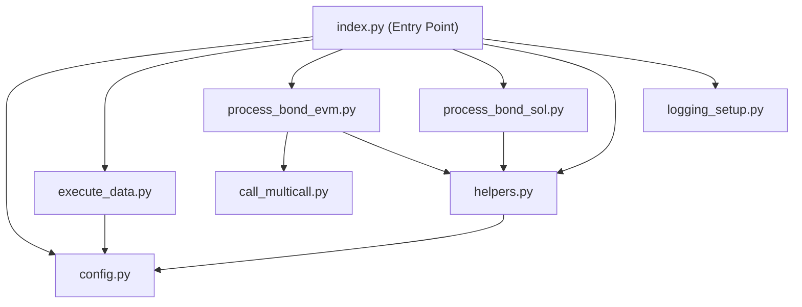
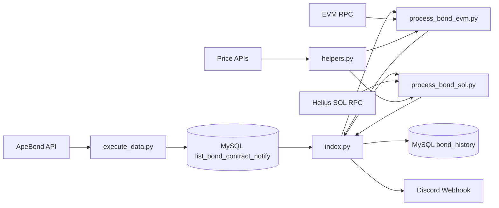
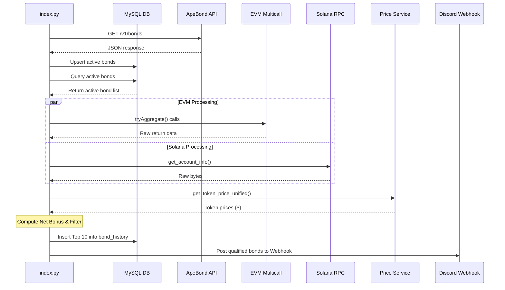

# 🚀 ApeBond Notify — Technical Analysis & Architecture Documentation

> **System:** `apebond-notify`  
> **Documentation:** Complete Technical Report & Source Code Analysis  
> **Report File:** [Baocao.md](file:///c:/apebond-notify/Baocao.md)

---

# Table of Contents

1. [Project Overview](#1-project-overview)
2. [Setup & Run](#2-setup--run)
3. [Entry Point](#3-entry-point)
4. [Runtime Flow](#4-runtime-flow)
5. [Bond Data Sources](#5-bond-data-sources)
6. [EVM Flow](#6-evm-flow)
7. [Solana Flow](#7-solana-flow)
8. [EVM vs Solana](#8-evm-vs-solana)
9. [Bond Field Traceability](#9-bond-field-traceability)
10. [Token Pricing](#10-token-pricing)
11. [Bond Price Formula](#11-bond-price-formula)
12. [Bonus Formula](#12-bonus-formula)
13. [Max Buy Formula](#13-max-buy-formula)
14. [Bond Validation](#14-bond-validation)
15. [Bond Ranking](#15-bond-ranking)
16. [Database Persistence](#16-database-persistence)
17. [Discord Notification](#17-discord-notification)
18. [Retry / Timeout / Cache](#18-retry--timeout--cache)
19. [Configuration](#19-configuration)
20. [Sensitive Data](#20-sensitive-data)
21. [Source Code Functional Classification](#21-source-code-functional-classification)
22. [Dependency Map](#22-dependency-map)
23. [Data Flow](#23-data-flow)
24. [Sequence Diagram](#24-sequence-diagram)
25. [Target Modules](#25-target-modules)
26. [Formula Table](#26-formula-table)
27. [Calculation Examples](#27-calculation-examples)
28. [Problems / Risks](#28-problems--risks)
29. [Questions to Confirm](#29-questions-to-confirm)
30. [Acceptance Criteria](#30-acceptance-criteria)
31. [Final Conclusion](#31-final-conclusion)

---

# 1. Project Overview

`apebond-notify` is an automated bond monitoring, financial calculation, ranking, and notification engine designed for **ApeBond** protocol opportunities across EVM-compatible chains and Solana.

* **Supported EVM Chains:** Ethereum (ETH), BNB Chain (BNB), Polygon (POL), Arbitrum (ARB), Base (BAS), Linea (LIN), Sonic (SON), Berachain (BER), Unichain (UNI), Hyperliquid (HYPER).
* **Supported Non-EVM:** Solana (SOL).

The main system objectives are:
1. Discover active bond contracts via ApeBond REST API.
2. Read on-chain bond state (EVM Multicall V3 & Solana binary layout parsing).
3. Resolve token market prices (ApeBond Price API -> CoinGecko -> DexScreener weighted liquidity & outlier filter).
4. Compute financial metrics: Net Bonus with fees, Max Buy, Min/Max Price.
5. Rank top 10 opportunities by `max_bonus` descending.
6. Persist results in MySQL (`bond_history`).
7. Notify qualifying bonds (where `min_bonus >= notify_threshold`) to Discord Webhook.

---

# 2. Setup & Run

## Requirements
* Python 3.8+
* MySQL 5.7+ / 8.0+

## Installation
```bash
# Clone repository
git clone <repository-url>
cd apebond-notify

# Setup virtual environment
python -m venv .venv

# Activate environment (Windows)
.venv\Scripts\activate
# Activate environment (Linux/macOS)
source .venv/bin/activate

# Install dependencies
pip install -r requirements.txt
```

## Running
```bash
python index.py
```

---

# 3. Entry Point

| Item | File | Function / Location | Description |
| :--- | :--- | :--- | :--- |
| **Entry Point** | `index.py` | `if __name__ == "__main__":` (L103-L123) | Application entry block |
| **Scheduler** | `helpers.py` | `set_bedtime()`, `sleep_until_wakeup()` | Pauses execution between 23:30 - 06:30 (VN Time) |
| **Bond Discovery** | `execute_data.py` | `fetch_and_update_bonds()` | Syncs bonds from `https://realtime-api.ape.bond/bonds` to MySQL |
| **EVM Processing** | `process_bond_evm.py` | `process_bonds()` | ThreadPoolExecutor (10 workers) + Multicall V3 |
| **Solana Processing** | `process_bond_sol.py` | `process_bond_sol()` | ThreadPoolExecutor (10 workers) + RPC Struct Unpacking |
| **Pricing** | `helpers.py` | `get_token_price_unified()` | Unified price resolution with RAM cache |
| **Ranking** | `index.py` | `save_and_notify_top_bonds_by_bonus()` | Sorts by `max_bonus` DESC, takes Top 10 |
| **Database** | `execute_data.py` | `create_database_and_table()`, `fetch_bond_data()` | MySQL DDL & DML operations |
| **Discord** | `helpers.py` | `send_discord_webhook_message()` | Posts notifications to Discord Webhook |

---

# 4. Runtime Flow

```text
index.py (__main__)
    │
    ├─► helpers.set_bedtime() ──(True)──► helpers.sleep_until_wakeup()
    │        │
    │     (False)
    │        │
    ├─► execute_data.fetch_and_update_bonds() ──► HTTP GET ApeBond API ──► Upsert DB
    ├─► execute_data.fetch_bond_data("EVM")  ──► Query active EVM bonds
    ├─► execute_data.fetch_bond_data("SOL")  ──► Query active SOL bonds
    │
    ├─► process_bond_evm.process_bonds() ──► ThreadPool (10) ──► Multicall V3 ──► Calc Net Bonus
    ├─► process_bond_sol.process_bond_sol() ──► ThreadPool (10) ──► Solana RPC ──► Calc Net Bonus
    │
    └─► index.save_and_notify_top_bonds_by_bonus()
             ├─► Merge EVM + SOL bonds
             ├─► Sort by max_bonus DESC ──► Cut Top 10
             ├─► Filter min_bonus >= notify_threshold
             ├─► Insert Top 10 to DB (bond_history)
             └─► helpers.send_discord_webhook_message() ──► POST Discord Webhook
```

---

# 5. Bond Data Sources

* **API Endpoint:** `https://realtime-api.ape.bond/bonds`
* **Method:** `GET`
* **Timeout:** 10 seconds
* **Parsing:** Unpacks `bonds` array. Maps `chainId` to chain string using `ID_CHAIN_MAP` (`config.py`). Filter out `soldOut: true`.
* **Upsert Query:**
  ```sql
  INSERT INTO list_bond_contract_notify (chain, contract_address, token_symbol, status)
  VALUES (%s, %s, %s, %s)
  ON DUPLICATE KEY UPDATE
      chain = VALUES(chain),
      token_symbol = VALUES(token_symbol),
      status = VALUES(status),
      updated_at = CURRENT_TIMESTAMP
  ```

---

# 6. EVM Flow

* **Multicall V3 Address:** `0xcA11bde05977b3631167028862bE2a173976CA11`
* **Contract Function Calls (via `tryAggregate`):**

| Contract Method | Function Selector | Return Type | Decoded Variable |
| :--- | :--- | :--- | :--- |
| `payoutToken()` | `0x868b5774` | `address` | `payout_token` |
| `principalToken()` | `0xb655b38d` | `address` | `principal_token` |
| `trueBillPrice()` | `0xd1eb01e0` | `uint256` | `true_bill_price` |
| `terms()` | `0x1f028fae` | `tuple(uint256[7])` | `terms` dict |
| `feeInPayout()` | `0x582ea8fd` | `uint256` | `fee_in_payout` |
| `trueBondPrices()` | `0x937c4d51` | `tuple[]` | `true_bond_price_tier` |

* **LP Token Pricing:** Evaluates `getReserves()` or fallback `getTotalAmounts()` on LP contract to compute LP token USD price from underlying reserves and token prices.

---

# 7. Solana Flow

* **Program ID:** `57GQDhcco4bv4Ngcg7gc6huEYepnGU4PZAGHQCFJmjNW`
* **Metaplex Program ID:** `metaqbxxUerdq28cj1RbAWkYQm3ybzjb6a8bt518x1s`
* **Binary Unpacking (`struct.unpack_from`):**
  - Skip 8-byte Anchor discriminator.
  - `parse_bond_issuance`: `payoutMint`, `principalMint`, `principalMintDecimals`, `payoutMintDecimals`, `feeInPrincipal`, `feeInPayout`, etc.
  - `parse_bond_pricing`: `total_debt`, `last_decay`, etc.
  - `parse_bond_term`: `control_variable`, `vesting_end`, `minimum_price`, `max_payout`, `max_total_payout`, `payout_token_initial_supply`.

---

# 8. EVM vs Solana

| Aspect | EVM (`process_bond_evm.py`) | Solana (`process_bond_sol.py`) |
| :--- | :--- | :--- |
| **Model** | Smart Contract state (`eth_call`) | Account data (`get_account_info`) |
| **Address** | 40-char Hex (`0x...`) | Base58 Public Key |
| **RPC** | Infura / Chain RPCs | Helius Solana RPC |
| **Multicall / Aggregation**| Multicall V3 `tryAggregate` | Single RPC calls per PDA account |
| **Data Format** | ABI encoded | Raw C-struct binary |
| **Decimals** | ERC20 `.decimals()` call | Unpacked from `BondIssuance` account |

---

# 9. Bond Field Traceability

| Final Field | Source File | Source Function | Original Source | Unit |
| :--- | :--- | :--- | :--- | :--- |
| `chain` | `execute_data.py` | `fetch_bond_data()` | DB column `chain` | String |
| `bond_name` | `execute_data.py` | `fetch_bond_data()` | DB column `token_symbol` | String |
| `bond_address` | `execute_data.py` | `fetch_bond_data()` | DB column `contract_address` | String |
| `date_time` | `process_bond_...` | `time.gmtime()` | UTC System Clock | `%Y-%m-%d %H:%M:%S` |
| `min_bonus` | `process_bond_...` | `calc_bonus_with_fee()` | Token prices + bill price | Percentage (%) |
| `max_bonus` | `process_bond_...` | `calc_bonus_with_fee()` | Token prices + tier price | Percentage (%) |
| `min_price` | `process_bond_...` | `terms` / `parse_bond_term` | `minimumPrice / 10^dec` | Float |
| `max_price` | `process_bond_...` | `terms` / `parse_bond_term` | `maxTotalPayout / 10^dec` | Float |
| `max_buy` | `process_bond_...` | `terms` / `parse_bond_term` | `maxPayout / 10^dec` | Float |

---

# 10. Token Pricing

Handled by `get_token_price_unified(chain_name, token_address)` in `helpers.py`:
1. **Memory Cache:** Checks `price_cache` dict.
2. **Primary Source:** ApeBond Price API (`https://price-api.ape.bond/realtime/prices`).
3. **Secondary Source:** CoinGecko API.
4. **Tertiary Source:** DexScreener API (Filters preferred quotes, removes Z-score outliers > 2, calculates liquidity-weighted average price).

---

# 11. Bond Price Formula

$$\text{bond\_price} = \text{principal\_token\_price} \times \left( \frac{\text{true\_bond\_price}}{10^{18}} \right)$$

---

# 12. Bonus Formula

$$\text{raw\_bonus} = \left( \frac{\text{payout\_token\_price}}{\text{bond\_price}} - 1 \right) \times 100$$

$$\text{bonus\_with\_fee} = \left[ \left(1 + \frac{\text{raw\_bonus}}{100}\right) \times \left(1 - \frac{\text{fee\_in\_payout} / 10000}{100}\right) - 1 \right] \times 100$$

---

# 13. Max Buy Formula

$$\text{max\_buy} = \frac{\text{terms.maxPayout}}{10^{\text{payout\_token\_decimals}}}$$

---

# 14. Bond Validation

Bonds are skipped if:
- `status != 'active'`
- `contract_address` is blacklisted (BG, AST, oABOND, SUSDT, EV, ETAN, GGBR, MASQ)
- `payout_token_price` or `principal_token_price` is 0 or invalid
- `bond_price < MIN_BOND_PRICE_THRESHOLD` (`max(1e-12, payout_token_price / 1000)`)

---

# 15. Bond Ranking

* **Metric:** `max_bonus`
* **Direction:** Descending (`reverse=True`)
* **Top N:** 10
* **Notification Threshold Filter:** `min_bonus >= notify_threshold` (default `10.0%`)

---

# 16. Database Persistence

* **Engine:** MySQL (`mysql.connector`)
* **Tables:**
  1. `list_bond_contract_notify`: Monitored active bonds.
  2. `bond_history`: Top 10 ranked bond history records.
  3. `token_info_cache`: Cached ERC20 token decimals & symbols.

---

# 17. Discord Notification

* **Endpoint:** `DISCORD_WEBHOOK_URL` (`config.py`)
* **Function:** `send_discord_webhook_message()` (`helpers.py`)
* **Format:** Bulleted list of top bonds satisfying `min_bonus >= threshold`.

---

# 18. Retry / Timeout / Cache

| Component | Retry | Timeout | Cache |
| :--- | :--- | :--- | :--- |
| **ApeBond API** | None | 10s | None |
| **EVM RPC** | None | Default | None |
| **Solana RPC** | None | Default | None |
| **CoinGecko API** | None | 10s | RAM dict `price_cache` |
| **DexScreener API** | None | 10s | RAM dict `price_cache` |
| **ABI Explorer** | None | 10s | Disk `abi_cache/*.json` |
| **Discord Webhook** | None | 5s | None |

---

# 19. Configuration

Centralized in `config.py` via `python-dotenv`:

| Variable | Description | Sensitive | Default / Fallback |
| :--- | :--- | :--- | :--- |
| `ENV` | Environment (`local` / `server`) | No | `"local"` |
| `DISCORD_WEBHOOK_URL` | Discord Webhook Endpoint | **Yes** | Webhook URL |
| `HELIUS_RPC_URL` | Solana RPC Endpoint | **Yes** | Helius RPC URL |
| `MIN_BONUS_NOTIFY` | Minimum Bonus % for Discord | No | `10.0` |
| `LOCAL_DB_HOST` | Local MySQL Host | No | `"127.0.0.1"` |
| `LOCAL_DB_USER` | Local MySQL User | No | `"root"` |
| `LOCAL_DB_PASS` | Local MySQL Pass | **Yes** | `""` |

---

# 20. Sensitive Data

> [!WARNING]
> All sensitive tokens, API keys, RPC credentials, and passwords in documentation and repository files must be redacted to `<REDACTED>`.

---

# 21. Source Code Functional Classification

| File | Primary Role | Core Functions |
| :--- | :--- | :--- |
| [`index.py`](file:///c:/apebond-notify/index.py) | Orchestrator & Ranking | `main`, `save_and_notify_top_bonds_by_bonus` |
| [`config.py`](file:///c:/apebond-notify/config.py) | Configuration | Env loading, Chain mappings |
| [`execute_data.py`](file:///c:/apebond-notify/execute_data.py) | Persistence & API Sync | `fetch_and_update_bonds`, `fetch_bond_data` |
| [`process_bond_evm.py`](file:///c:/apebond-notify/process_bond_evm.py) | EVM Reader & Math | `process_bonds`, `process_single_bond_evm` |
| [`process_bond_sol.py`](file:///c:/apebond-notify/process_bond_sol.py) | Solana Reader & Math | `process_bond_sol`, `process_single_bond_sol` |
| [`helpers.py`](file:///c:/apebond-notify/helpers.py) | Pricing & Discord | `get_token_price_unified`, `send_discord_webhook_message` |
| [`call_multicall.py`](file:///c:/apebond-notify/call_multicall.py) | Multicall V3 ABI/Decoders | `decode_address`, `decode_terms`, `decode_true_bond_prices` |
| [`logging_setup.py`](file:///c:/apebond-notify/logging_setup.py) | Logging | `setup_logger` |

---

# 22. Dependency Map



---

# 23. Data Flow



---

# 24. Sequence Diagram



---

# 25. Target Modules

Proposed modular structure:
```text
apebond_notify/
├── main.py
├── config/
│   └── settings.py
├── discovery/
│   └── apebond_api.py
├── blockchain/
│   ├── evm/
│   └── solana/
├── pricing/
│   └── price_service.py
├── domain/
│   ├── calculations.py
│   ├── validation.py
│   └── ranking.py
├── persistence/
│   └── repositories.py
└── notification/
    └── discord_notifier.py
```

---

# 26. Formula Table

| Name | Inputs | Output | Unit | Fallback |
| :--- | :--- | :--- | :--- | :--- |
| **Debt Decay** | `total_debt`, `last_decay`, `current_time`, `vesting_term` | `debt_decay` | Raw Units | Return `total_debt` if `vesting_term == 0` |
| **Bill Price** | `control_variable`, `debt_ratio`, `principal_decimals` | `bill_price` | Raw Units | Clamp to `minimum_price` |
| **True Bond Price**| `bill_price`, `fee_in_principal` | `true_bond_price` | Scale 1e6 | Raw calculation |
| **Bond Price** | `principal_token_price`, `true_bond_price` | `bond_price` | USD ($) | Skip if `< MIN_BOND_PRICE_THRESHOLD` |
| **Net Bonus** | `bonus`, `fee_in_payout` | `min_bonus` / `max_bonus` | Percentage (%) | `calc_bonus_with_fee()` |

---

# 27. Calculation Examples

Given:
- `payout_token_price` = $2.00
- `principal_token_price` = $100.00
- `true_bill_price` = $15,000,000,000,000,000$ ($0.015 \times 10^{18}$)
- `fee_in_payout` = $200$ (2%)

Calculations:
1. $\text{bond\_price} = 100.00 \times 0.015 = \$1.50$
2. $\text{raw\_bonus} = \left(\frac{2.00}{1.50} - 1\right) \times 100 = 33.33\%$
3. $\text{bonus\_with\_fee} = \left[(1 + 0.3333) \times \left(1 - \frac{0.02}{100}\right) - 1\right] \times 100 = 33.30\%$

---

# 28. Problems / Risks

1. **Critical:** `NameError: name 'get_connection' is not defined` in `index.py` L33.
2. **High:** Solana bond sync skipped (`if chain_id == 10143: continue`) in `execute_data.py` L251.
3. **High:** `NameError: name 'API_URLS' is not defined` in `process_bond_evm.py` L27.
4. **Critical:** Hardcoded API keys and secrets in `config.py` and `call_multicall.py`.
5. **Medium:** Duplicate pricing logic in `get_price.py` vs `helpers.py`.
6. **High:** Missing retry/backoff wrappers around RPC and Webhook network requests.
7. **Medium:** `fetch_bond_data` SQL query lacks `WHERE status = 'active'`.
8. **Medium:** RAM `price_cache` lacks TTL/expiration policy.

---

# 29. Questions to Confirm

1. **Solana Sync:** Should Solana bonds be automatically synced from API ApeBond or managed manually in DB?
2. **Pricing Priority:** Is the current fallback hierarchy (`ApeBond -> CoinGecko -> DexScreener`) authoritative?
3. **Cache TTL:** What is the preferred TTL for RAM price caching (e.g. 5 minutes)?
4. **Vesting Term 0:** Is returning `total_debt` when `vesting_term == 0` standard protocol behavior?
5. **Per-Chain Thresholds:** Should `notify_threshold` be configurable per chain or kept global?

---

# 30. Acceptance Criteria

* [x] Entry point & runtime activation mapped.
* [x] EVM & Solana flows completely traced.
* [x] EVM vs Solana differences documented.
* [x] Field traceability & token pricing verified against code.
* [x] Financial formulas, validation, and ranking mapped 100% to actual Python code.
* [x] Database, Discord, Retry, and Config documented.
* [x] Secrets redacted.
* [x] Mermaid diagrams (Dependency Map, Data Flow, Sequence Diagram) included.
* [x] Target module structure proposed.
* [x] Real codebase bugs & risks identified.

---

# 31. Final Conclusion

The `apebond-notify` application is an effective automated bond scanner, but currently suffers from tight coupling between blockchain state readers and financial math, hardcoded secrets, duplicate pricing services, and critical missing imports in `index.py` and `process_bond_evm.py`. Refactoring into the proposed target modular architecture will isolate blockchain reading from business rules, enhance maintainability, and stabilize system execution.
